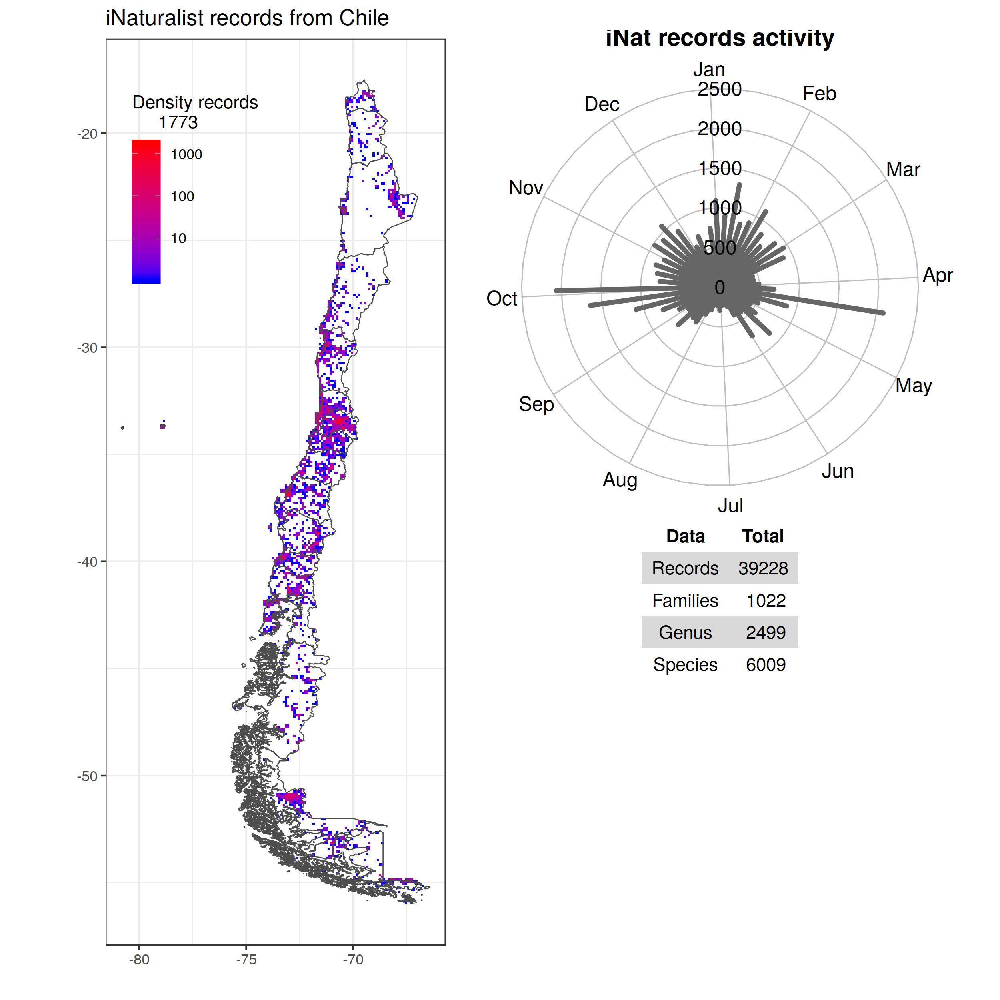

# iNaturalist_Chile
R scripts for process and plot iNaturalist data records from Chile.

## Getting Started

These R script is based enterely on package [bdvis](https://github.com/vijaybarve/bdvis) - Biodiversity Data Visualizations using R. This package offers a set of functions to visualize biodiversity occurrence data through R. Please check the paper describing the package Barve, V., and J. Otegui. 2016. bdvis: visualizing biodiversity data in R. Bioinformatics:btw333. https://academic.oup.com/bioinformatics/article/32/19/3049/2196391

## Sources

* [iNaturalist](https://www.inaturalist.org/observations?place_id=7182) - Download data base directly from iNaturalist web.
* [ide.cl](http://www.ide.cl/descargas/capas/subdere/DivisionPoliticaAdministrativa2019.zip) - The shape file for Chile 2019 were download from IDE-Chile: Infraestructura de Datos Geoespaciales de Chile.

## Final result

## License

This project is licensed under the GNU General Public License v3.0 - see the [LICENSE.md](LICENSE.md) file for details

## Acknowledgments

@erasmomac
